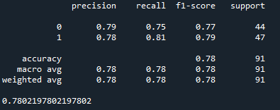
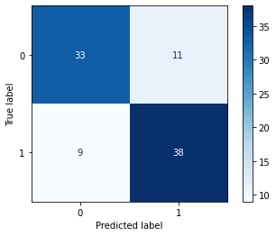
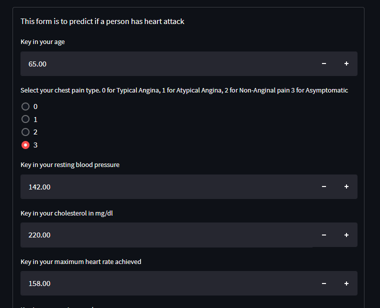
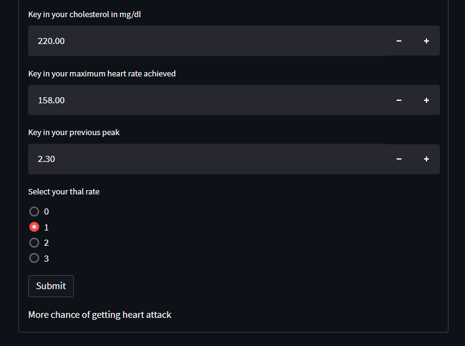

# Heart Attack Predictor

The objective of this model to predict whether a person has a chance to get a heart disease.
Heart attack has been a common occurence among humans. So a precatious measure is highly
recommended to avoid any unwanted incidents.

## Results

The model scored an accuracy of 78%. The best pipeline for this model is to use 
MinMaxScaler and Logistic Regression. 
The model can be further improven if we have more datas.

## Application

An app is created for users to input their information to predict heart attack possibilities
using the model developed.

## Credits

The data is downloaded from
[Kaggle](https://www.kaggle.com/datasets/rashikrahmanpritom/heart-attack-analysis-prediction-dataset)

